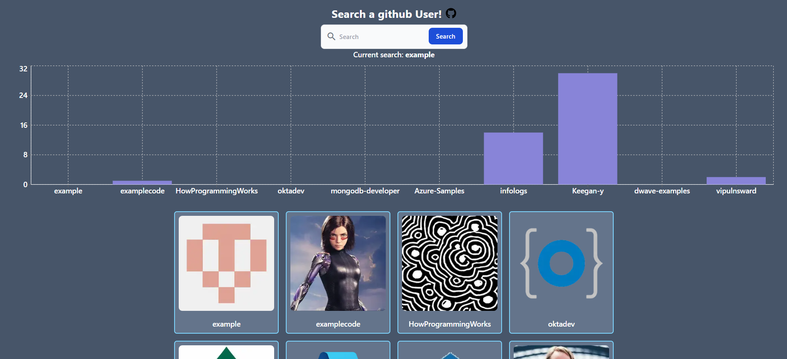
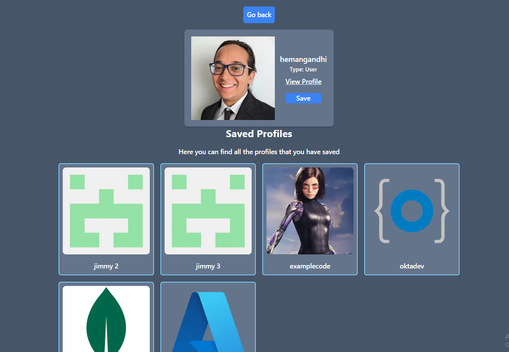

<p align="center">
  <a href="https://nextjs.org/" target="blank"></a>
  <a href="http://nestjs.com/" target="blank"></a>

</p>
</p>

<p align="center">A full-stack web application built using Next.js, NestJS, GraphQL, React Query, TypeScript, Tailwind CSS, and Recharts.</p>

## Live App description!

In this app you can search and use the free github api to search for all the users, you can scroll down with an infinite query and see the number of followers of first ten users of the list:



Also you can see more details of the profile and if you want, you can save it in a database and check a list of the saved users:



## Technologies Stack Used

- [Next.js](https://nextjs.org/): A React framework for building server-side rendered and statically exported applications.
- [NestJS](https://nestjs.com/): A progressive Node.js framework for building efficient and scalable server-side applications.
- [GraphQL](https://graphql.org/): A query language for APIs that enables a more efficient and flexible way of fetching data.
- [React Query](https://react-query.tanstack.com/): A library for managing, caching, synchronizing, and updating server state in React applications.
- [TypeScript](https://www.typescriptlang.org/): A typed superset of JavaScript that compiles to plain JavaScript.
- [Tailwind CSS](https://tailwindcss.com/): A utility-first CSS framework for quickly building custom designs.
- [Recharts](https://recharts.org/): A charting library built on React components for data visualization.
- [Docker](https://www.docker.com/): A platform for developing, shipping, and running applications inside containers.
- [Docker Compose](https://docs.docker.com/compose/): A tool for defining and running multi-container Docker applications.

## Backend Installation

1. Clone the repository and navigate to the back folder

```bash
$ cd .\Back\
```

2. Replace the .env.example file with .env, this environment variables are used in the porject and in the docker compose file
3. Execute:

```bash
$ npm install
```

4. Set up the database with docker

```bash
$ docker-compose up -d
```

5. You can add autoload entities in order to create the database automatically (not recomended for production), instead you can run the following typeOrm commands to create the migration (Just in case that you dont have the migration folder and file inside the db folder you can skip this step), every time that you make a change in the entities a new migration should be generated:

```bash
$ npm run migration:generate db/migrations/testMigration
```

This will generate inside the `db/migration` folder a typescript file with all the querys to create the tables

6. To load this testMigration with the CLI you can use

```bash
$ npm run migration:run
```

In case that you already have a migration file and want to purge your db, you can use:

```bash
$ npm run migration:revert
```

7. Running the app

```bash
# development
$ npm run start:dev
```

8. Open the graphql playground

`http://localhost:3001/graphql`

## Front End Installation

1. Go Back and navigate to the front folder

```bash
$ cd ..
$ cd .\Front\
```

2. Execute:

```bash
$ npm install
```

3. Run the project in dev Mode

```bash
$ npm run dev
```

4. Open the project

`http://localhost:3000`
